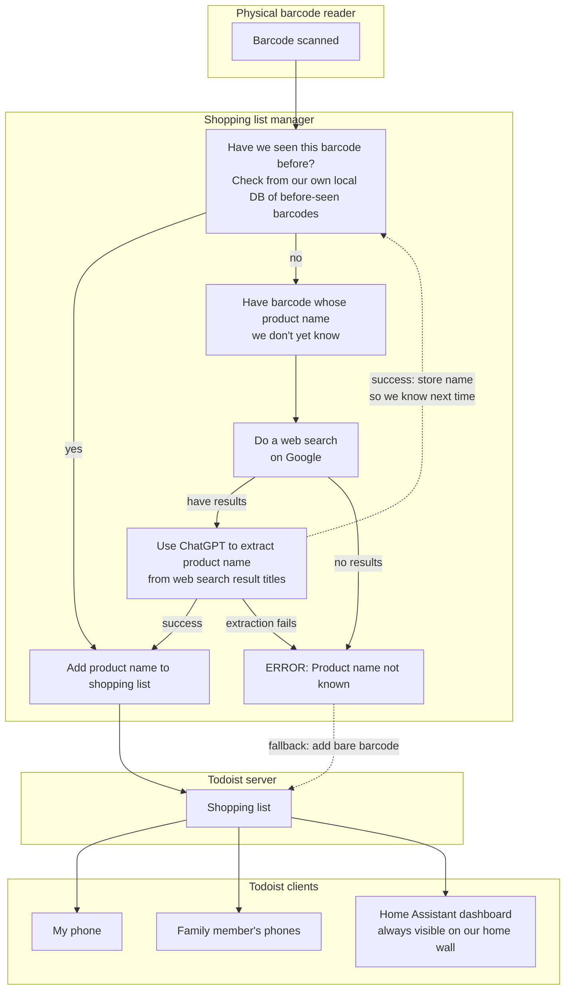

⬆️ For table of contents, click the above icon

Listen for barcode scans from a barcode reader and add their product names to shopping list


Overview
--------




How to run
----------

First source `app.env` (which has the ENV variables from the configuration section), then:

```shell
docker run --rm -it --device /dev/input/by-id/usb-NT_USB_Keyboard-event-kbd:/dev/barcode-reader -e OPENAI_API_KEY -e TODOIST_TOKEN -e TODOIST_PROJECT_ID -e GOOGLE_SEARCH_CUSTOM_SEARCH_ENGINE_ID -e GOOGLE_SEARCH_API_KEY ghcr.io/joonas-fi/shopping-list-manager:latest
```


Hardware
--------

Should work with any barcode reader that works on Linux. The wireless ones are really convenient.

I used this: [NETUM NT-1228BL](https://www.amazon.de/dp/B07CBS52KJ)


Configuration
-------------

You'll need to configure ENV variables:

- `BARCODE_READER` (example `/dev/input/by-id/usb-NT_USB_Keyboard-event-kbd`)
- `OPENAI_API_KEY` (create [here](https://platform.openai.com/api-keys))
- `TODOIST_TOKEN`
- `TODOIST_PROJECT_ID`
- `GOOGLE_SEARCH_CUSTOM_SEARCH_ENGINE_ID`
- `GOOGLE_SEARCH_API_KEY` (get [here](https://developers.google.com/custom-search/v1/overview))
- `WEBAPP_BASEURL` (optional) base URL of the web app (so we can make links back to it)


Resolving unknown barcodes
--------------------------

There are web APIs to barcode databases where you can resolve the product name from.

However those are either bad (only have small subset of real-world barcodes) or really expensive
(I'm not paying hundreds of dollars a month for this use case), so I opted to use web search as a "database".


External services
-----------------

- Todoist
- For resolving unknown barcodes:
	* Google
	* ChatGPT